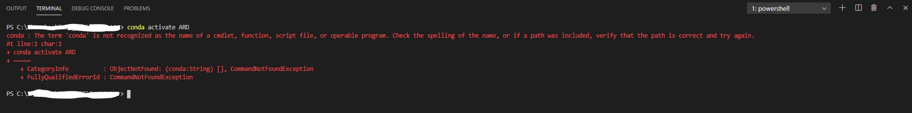
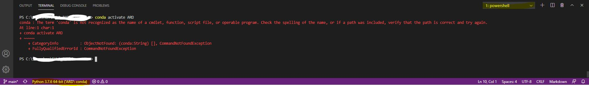
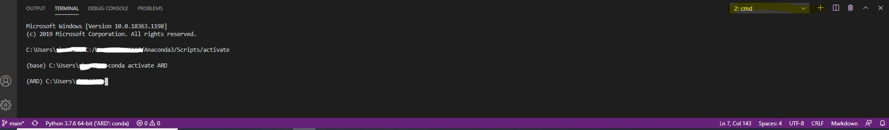

# This document records common errors you may have while using python
## VSCode
1. conda is not recognized

Solution: 
    * Set the Interpreter to Python 3.7.6 ('ARD':conda) (or the python environment you'd like to use)
    
    * Rather than using "PowerShell", switch to "Command Prompt". From the dropdown, select "Select Default Shell", from the dropdown select "Comamnd Prompt", then click "+" to add a new promp terminal -> now it's in conda (ARD) environment.
    

